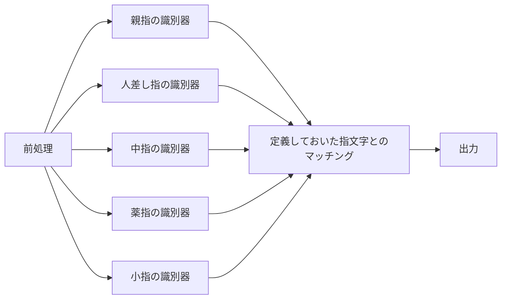

# 開発目的

- NVIDIAが認定している「Jetson AI Specialist」[1] に提出することが目的

- Googleが開発したmediapipe[2] [3]を使用して計21か所の指の関節の座標をもとにどの指文字をしているか認識するプログラム

  

[1] https://developer.nvidia.com/ja-jp/embedded/learn/jetson-ai-certification-programs

[2] https://google.github.io/mediapipe/

[3] https://google.github.io/mediapipe/solutions/hands.html

# 開発環境

| 名前                  | バージョン |
| --------------------- | ---------- |
| OS                    | Windows10  |
| CPU                   | i5-1035G4  |
| Memory                | 8GB        |
| Python                | 3.8.5      |
| scikit-learn          | 0.23.2     |
| opencv-contrib-python | 4.5.1.48   |
| mediapipe             | 0.8.7.3    |

# フォルダ一覧

| フォルダ名 | 説明                                                         |
| ---------- | ------------------------------------------------------------ |
| word5      | Nvidiaへ提出予定のプログラム   "あいうえお"の5文字のみ対応   |
| 近日公開   | あいうえお  かきくけこ  さしすせそ  たちつて　 なにぬね　 　ひふへ　 まみむめ　 やゆよ　　 ら　るれろ  全37文字 |
|            |                                                              |

# アルゴリズム

指文字の識別には対応している文字数によって使用しているアルゴリズムと特徴量が変わっている。あ行の5文字のみはword5内のREADME.mdに記述している。

37文字の場合は指文字は各指の曲がっている関節の組み合わせが異なっているため、各指で曲がっている関節が特定できればどの指文字をしているかを一意に特定することができる。

同じ指で複数関節が曲がっている場合は手首からみて初めに曲がっている関節を曲がっている関節と定義している。また、親指の定義はグッドをしたときの立っている親指を伸びているとしている。

### フローチャート

# データセット

# 学習方法

1. データセットを学習用と検証用に分割
2. 特徴量生成
3. 前処理
4. 遺伝的アルゴリズムを使って精度が高い特徴量を求める
5. 求めた特徴量から重要度が0より大きいもののみを使ってデータセットすべてのデータを使った学習させる

## 前処理

1. 0番(WRIST)を原点として各座標をずらす

2. 0番と9番が垂直になるように回転させる

   

## 特徴量エンジニアリング

特徴量を多くしても必ずしも精度が向上することはなく逆に減少することもある。そのため、高い精度を出すことができる特徴量を選定する必要がある。今回は遺伝的アルゴリズムを使用した。遺伝的アルゴリズムのパラメータは以下の表に示す。また、特徴量の候補の一覧を表に示す。

### 遺伝的アルゴリズムパラメータ

| 選択方法   | エリート戦略 |
| ---------- | ------------ |
| 交叉       | 二点交叉     |
| 交叉率     | 79%          |
| 突然変異率 | 1%           |
| 再生確率   | 20%          |
| 個体数     | 50           |
| 最大世代数 | 50           |

### 特徴量候補一覧

- 極座標

  - 原点と第三関節
  - 第三関節と第二関節
  - 第二関節と第一関節
  - 第一関節と指先

- 2点間の角度

  - 原点と第三関節
  - 第三関節と第二関節
  - 第二関節と第一関節
  - 第一関節と指先
  - 第三関節と第一関節
  - 第二関節と指先
  - 第三関節と指先

- 2点間の距離

  - 原点と第三関節の距離
  - 原点と第二関節の距離
  - 原点と第一関節の距離
  - 原点と指先の距離
  - 第三関節と第二関節の距離
  - 第二関節と第一関節の距離
  - 第一関節と指先の距離

- 値が1の場合第三関節で曲がっている可能性が高く、値によってどの関節で曲がっているかの判断基準
  $$
  \frac{原点と第三関節の距離}{max(原点と第三関節の距離, 原点と第二関節の距離, 原点と第一関節の距離, 原点と指先の距離)}
  $$
  
- 関節が均等に伸びていればdist_minは大きくなり0に近づき、曲がっていると逆に1に近づくため判断基準
  $$
  dist_{min} = min \left(
  \begin{array}{ll}
  第三関節と第二関節の距離 \\
  第二関節と第一関節の距離 \\ 
  第一関節と指先の距離 \\
  \end{array}
  \right) \\
  dist_{max} = max \left(
  \begin{array}{ll}
  第三関節と第二関節の距離 \\
  第二関節と第一関節の距離 \\ 
  第一関節と指先の距離 \\
  \end{array}
  \right)
  
  \\
  \frac{dist_{max}-dist_{min}}{dist_{max}}
  \\
  $$

- 関節が伸びていれば関節間の総和と最も伸びている指を3倍した値の値は1に近づき、曲がっていれば0に近づくため判断基準
  $$
  dist_{total} = sum \left(
  \begin{array}{ll}
  第三関節と第二関節の距離 \\
  第二関節と第一関節の距離 \\ 
  第一関節と指先の距離 \\
  \end{array}
  \right) \\
  
  \frac{dist_{total}}{3 \times dist_{max}}
  $$
  
- 3点間の角度

  - 原点、第三関節、第二関節、第一関節、指先から3つの順列を全て

- 指先、第一関節、第二関節、第三関節のなかで最もy座標が小さいものが指先かどうか

- 指先、第一関節、第二関節、第三関節のなかで最もy座標が大きいものが指先かどうか

- 第三関節のy座標 < 第一関節のy座標かどうか

