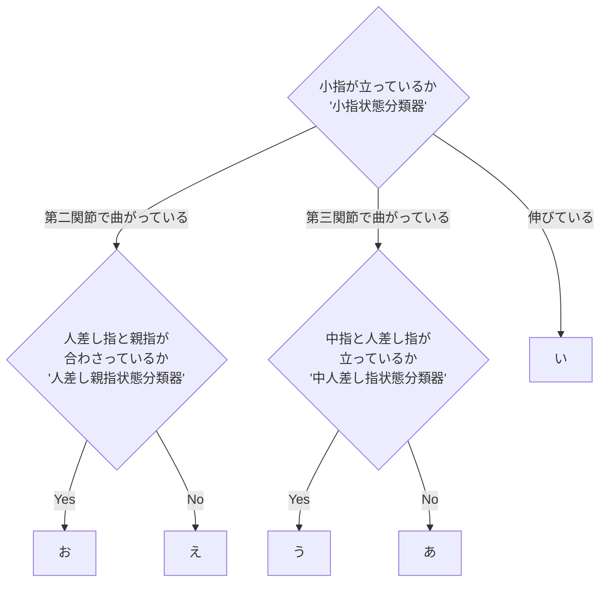

# アルゴリズム

あいうえおの人差し指の第三関節文字のみを識別する場合まず小指の曲がり具合の状態で3つのグループに分けることができる。伸びている場合は「い」が確定する。第三関節で曲がっている場合は「あ」または「う」のどちらかになり、中指と人差し指が立っている場合は「う」となり立っていない場合は「あ」となる。また、小指が第二関節で曲がっている場合は「え」または「お」のどちらかになり、人差し指と親指が合わさっている場合は「お」となり、合わさっていない場合は「え」となる。以上のことから人差し指の第三関節文字を識別することが可能となる。

以後、小指が立っているか判定する分類器を小指状態分類器、人差し指と親指が合わさっているか判定する分類器を人差し親指状態分類器、中指と人差し指が立っているか判定する分類器を中人差し指状態分類器と呼称する。

#### フローチャート

# 各指がどの関節で曲がっているか定義したリスト

| 指文字     | 親指       | 人差し指   | 中指    | 薬指       | 小指 |　親指と人差し指と中指の状態 |
| ---------- | ---------- | ---------- | ------- | ---------- | ---- | ---- |
| あ   | 伸びている | 第三関節    | 第三関節    | 第三関節 | 第三関節    | 離れている |
| い   | 伸びていない | 第三関節    | 第三関節    | 第三関節 | 伸びている |離れている|
| う   | 伸びていない | 伸びている | 伸びている | 第三関節 | 第三関節    |離れている|
| え   | 第二関節 | 第二関節 | 第二関節 | 第二関節 | 第二関節 |離れている|
| お   | 第二関節 | 第二関節 | 第二関節 | 第二関節 | 第二関節 |合わさっている|

※　親指の伸びているの定義はグッドのように指立っている時を伸びているとしている

# 学習

## 最も精度が高い特徴量リスト

### 小指状態分類器

##### 角度補正後のデータ

- 極座標
  
  - 原点と薬指の第三関節
- 3点間の角度
  - 小指の第三関節, 小指の第二関節, 小指の第一関節
  - 小指の第三関節, 小指の第一関節, 小指の指先
  - 小指の第二関節, 小指の指先, 小指の第三関節
  - 小指の第二関節, 小指の指先, 小指の第一関節
  - 小指の指先, 小指の第一関節, 小指の第二関節
- 2点間の角度
  - 小指の第三関節と小指の指先

### 中人差し指状態分類器

##### 角度補正後のデータ
- 2点間の距離
  - 原点と中指の指先
  

### 親指状態分類器

##### 角度補正後のデータ

- 極座標

  - 親指の第一関節と親指の指先
- 3点間の角度
  - 親指の第一関節,中指の指先,親指の指先
  - 親指の指先,親指の第一関節,中指の指先
  - 人差し指の指先,中指の指先,親指の指先
- 2点間の距離
  - 原点と中指の指先

## 学習パラメータ

### 決定木のパラメータ

| name         | parameter |
| ------------ | --------- |
| max_depth    | 5         |
| random_state | 69        |

## 学習結果

### 小指状態分類器

「あ」、「い」、「う」、「え」、「お」のデータで学習

- train data size：119
- test data size   : 65

- 横軸：世代数、縦軸：各世代の最大正答率

#### 混同行列

| classes | label  |
| ------- | ------ |
| 0       | あ、う |
| 1       | い     |
| 2       | え、お |

### 中人差し指状態分類器

「あ」、「う」のみのデータで学習

- train data size：48
- test data size   : 26

- 横軸：世代数、縦軸：各世代の最大正答率

#### 混同行列

| classes | label |
| ------- | ----- |
| 0       | あ    |
| 1       | う    |

### 親指状態分類器

「え」、「お」のみのデータで学習

- train data size：47
- test data size   : 26

- 横軸：世代数、縦軸：各世代の最大正答率

| classes | label |
| ------- | ----- |
| 0       | え    |
| 1       | お    |

